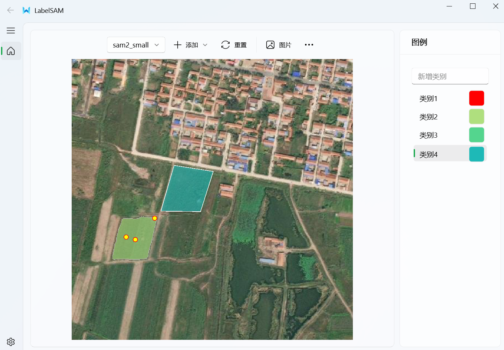
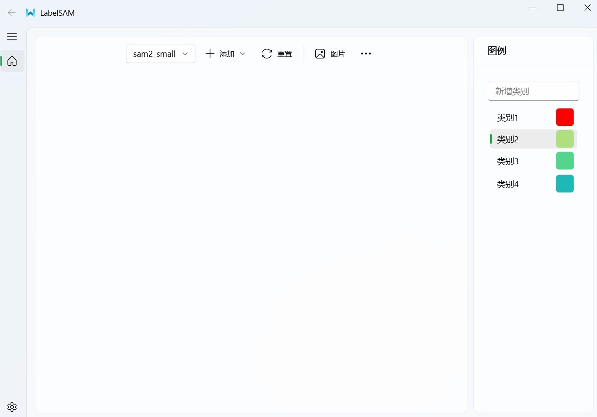
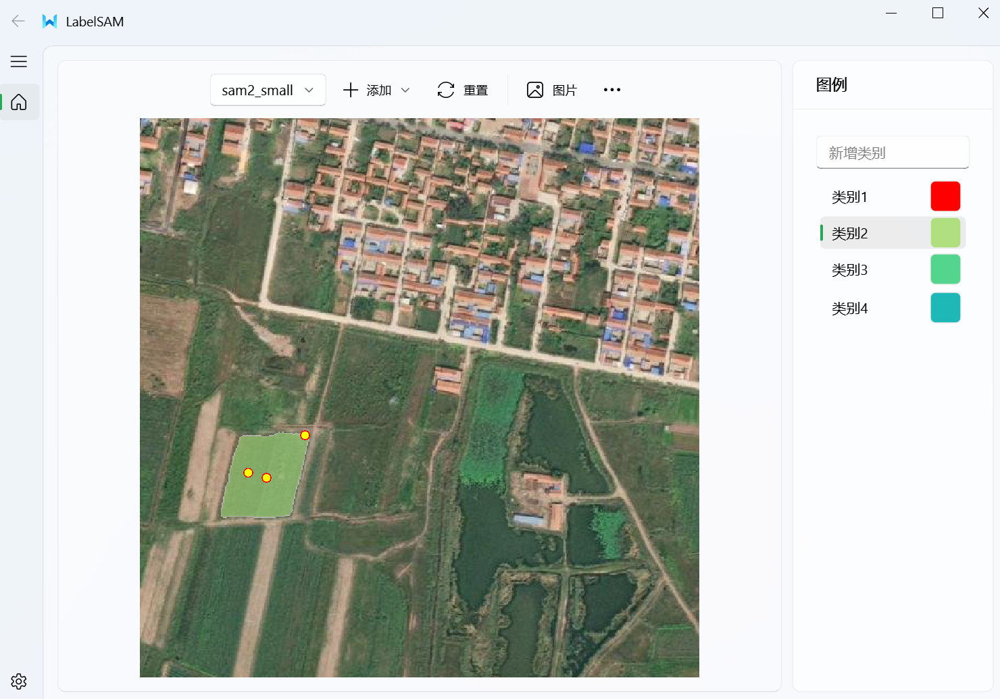
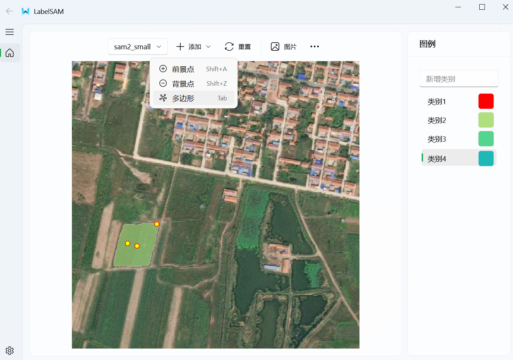
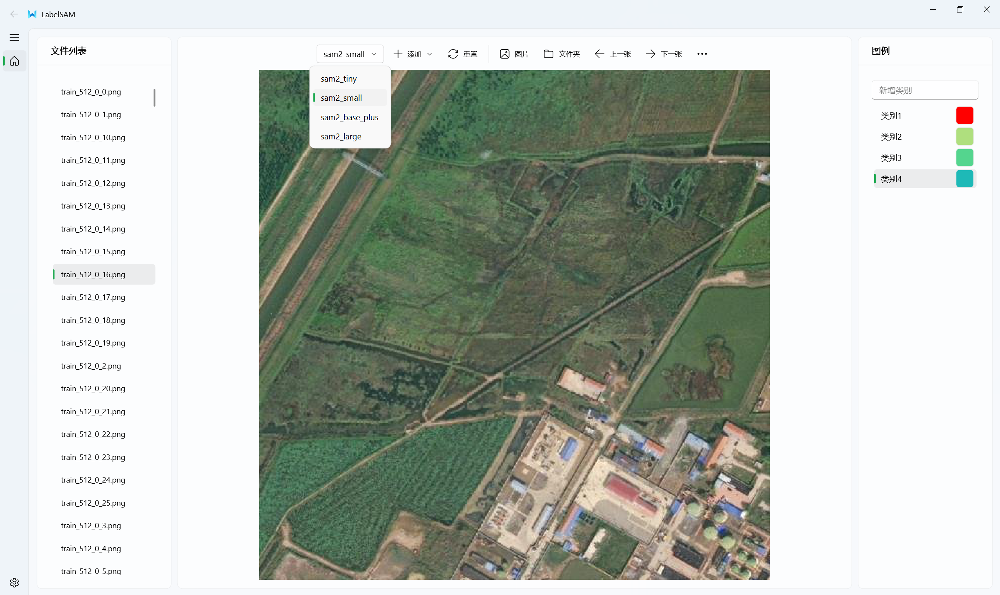
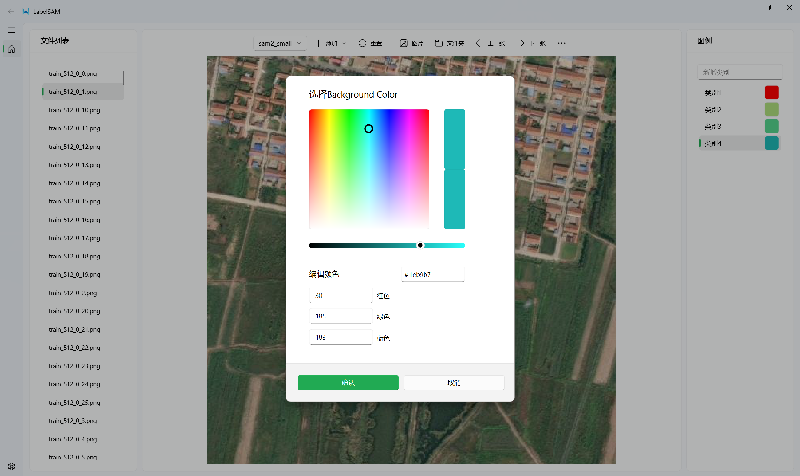
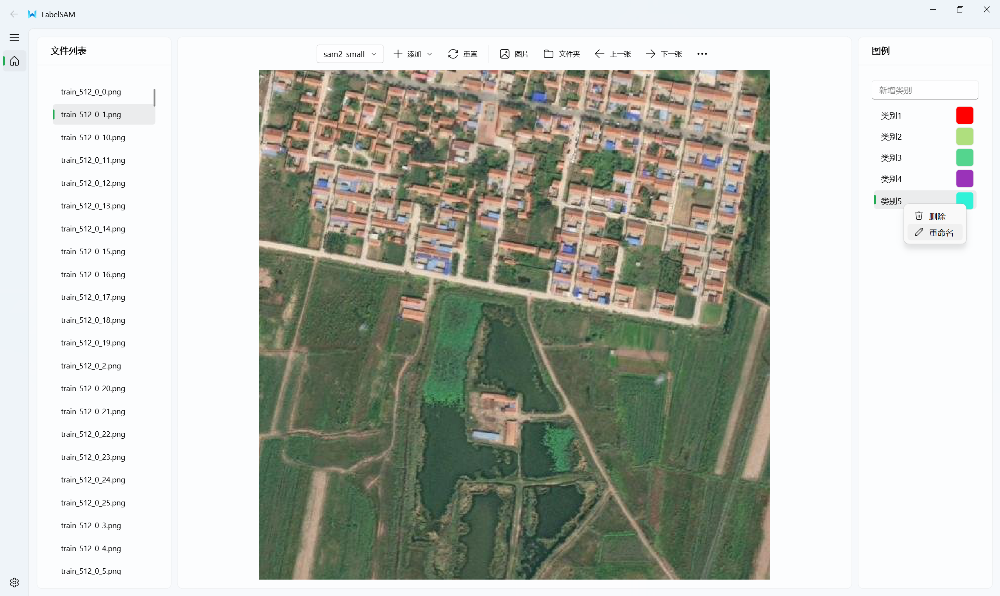
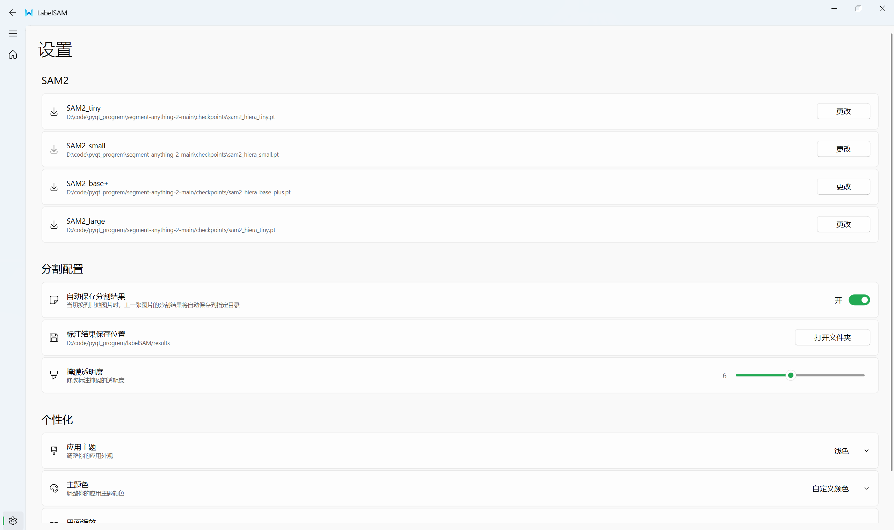

# LabelSAM - 图像分割标注工具

**LabelSAM** 是一个用户友好的图像分割标注工具，利用 Segment Anything Model (SAM) 简化了标注过程。该工具允许通过简单的鼠标交互实现快速、精确的图像分割，并提供手动标注和以 JSON 格式导出标签的灵活选项。

## 功能特点

- **支持 SAM 点提示**：
    - 使用鼠标点击在图像上定义**前景**和**背景**点。
    - 基于点击的点立即分割对象。
  
- **多边形遮罩绘制**：
    - 手动绘制多边形遮罩以实现精确分割。
    - 适用于自动分割需要精细调整的区域。
  
- **JSON 导出**：
    - 以 JSON 文件格式保存您的标注，方便与其他工具集成或进一步处理。
  
- **现代化 UI**：
    - 使用 **PyQt5** 构建，结合 **PyQt-Fluent** 提供的美学增强，LabelSAM 提供了简洁直观的界面。

## 安装

要开始使用 **LabelSAM**，请按照以下步骤操作：

1. 克隆此仓库：
    ```bash
    git clone https://github.com/bvcg204/LabelSAM.git
    cd LabelSAM
    ```

2. 安装 SAM2 (https://github.com/facebookresearch/segment-anything-2)

3. 安装 QFluentWidgets (https://qfluentwidgets.com/zh/pages/install)
   
4. 运行工具：
    ```bash
    python labelSAM.py
    ```

## 使用方法

1. **加载图像**： 
    - 通过选择 `Open` 按钮或将文件拖入工具中加载任意图像。

2. **SAM 点分割**：
    - 点击以在您想分割的对象上放置**前景点**。
    - 点击放置**背景点**以优化分割效果。
    - 鼠标左键绘制前（背）景点，右键确定本次分割掩码
  
3. **多边形遮罩绘制**：
    - 使用多边形工具手动绘制精确的遮罩，以处理需要的区域。
    - 鼠标左键绘制多边形点，右键完成本次多边形绘制

4. **导出**：
    - 标注完成后，点击 `Export` 按钮导出，系统会将您的标注保存为结构化的 JSON 格式。

## 演示图片

在以下位置插入你想要展示的演示图片：

- **主页面**：

      

- **点提示自动分割标注（左键绘制右键完成）**：

      

- **支持手动绘制多边形（左键绘制右键完成）**：

      
      

- **多模型切换&批量图片导入**：

     

- **图例颜色修改**：

     

- **图例增删改**：

     

- **设置**：

     
